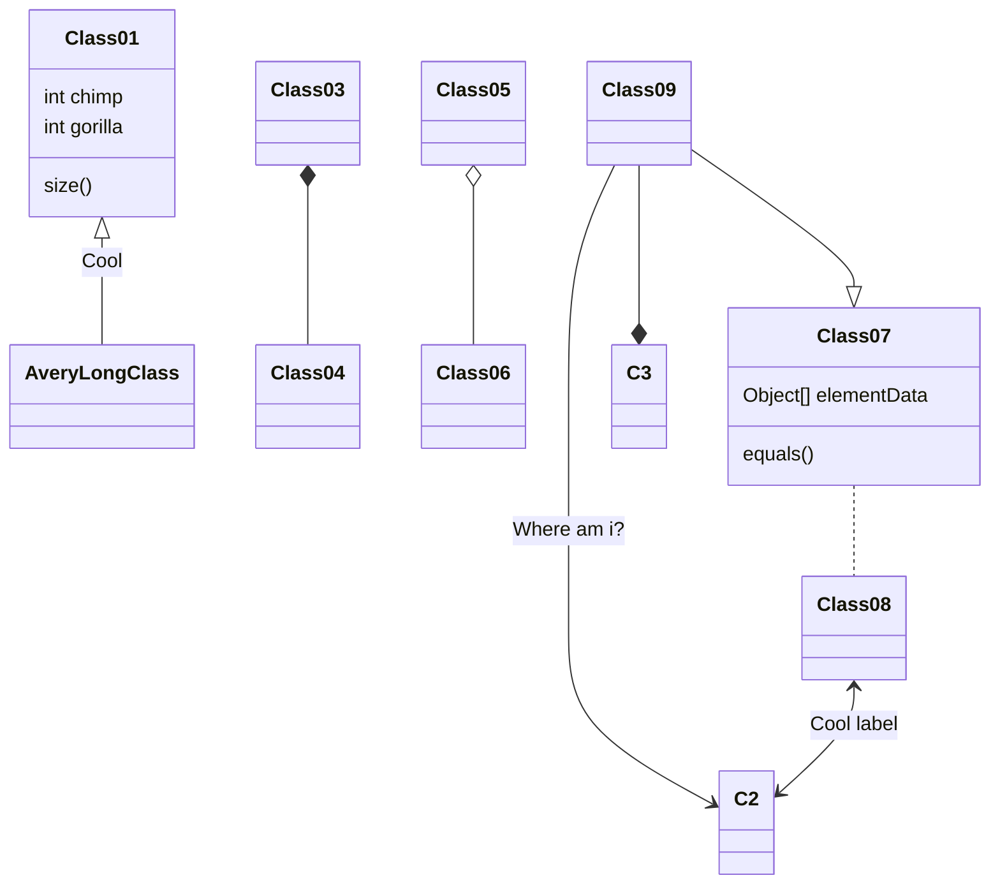
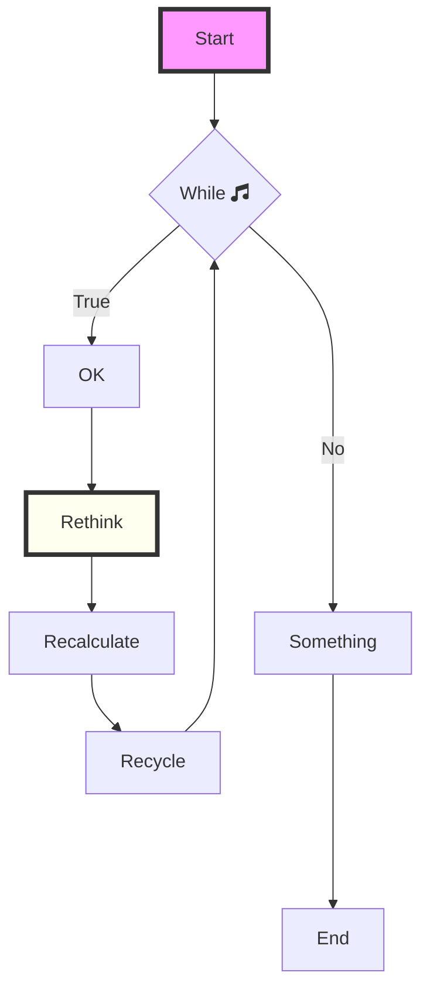
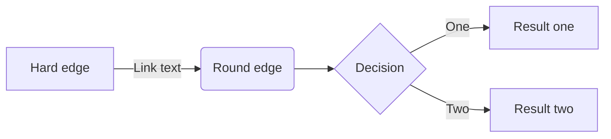

# Hello there

How are you?

```mermaid
graph TD;
    A-->B;
    A-->C;
    B-->D;
    C-->D;
```

Another one

```mermaid
classDiagram
Class01 <|-- AveryLongClass : Cool
Class03 *-- Class04
Class05 o-- Class06
Class07 .. Class08
Class09 --> C2 : Where am i?
Class09 --* C3
Class09 --|> Class07
Class07 : equals()
Class07 : Object[] elementData
Class01 : size()
Class01 : int chimp
Class01 : int gorilla
Class08 <--> C2: Cool label
```

Another one

```mermaid
flowchart TD
    A[Start] --> B{"While fa:fa-music"}
    style A fill:#f9f,stroke:#333,stroke-width:4px
    B -->|True| C[OK]
    C --> D[Rethink]
    D --> X[Recalculate]
    X --> Y[Recycle]
    style D fill:#ffee,stroke:#333,stroke-width:4px
    Y --> B
    B ---->|No| Z[Something]
    Z ---->E[End]

```

Another one

```mermaid
flowchart LR
    A[Hard edge] -->|Link text| B(Round edge)
    B --> C{Decision}
    C -->|One| D[Result one]
    C -->|Two| E[Result two]

```